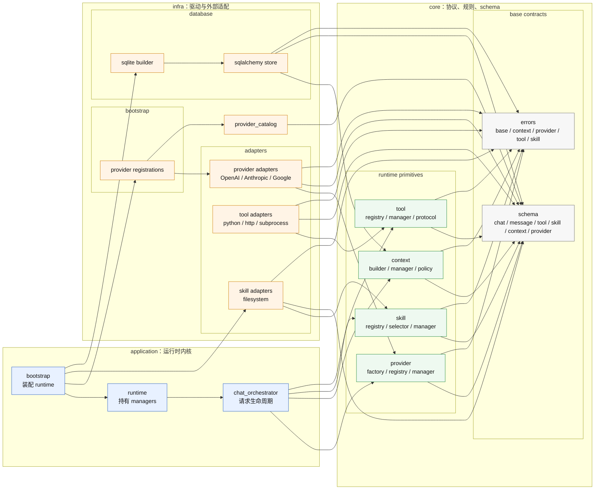

```mermaid
flowchart LR
  %% =====================
  %% Application Layer
  %% =====================
  subgraph APP["application：运行时内核"]
    direction TB
    app_boot["bootstrap\n装配 runtime"]
    app_runtime["runtime\n持有 managers"]
    app_chat["chat_orchestrator\n请求生命周期"]
  end

  %% =====================
  %% Infra Layer
  %% =====================
  subgraph INFRA["infra：驱动与外部适配"]
    direction TB

    subgraph INFRA_BOOT["bootstrap"]
      provider_regs["provider registrations"]
    end

    subgraph INFRA_ADAPTERS["adapters"]
      provider_adapters["provider adapters\nOpenAI / Anthropic / Google"]
      tool_adapters["tool adapters\npython / http / subprocess"]
      skill_adapters["skill adapters\nfilesystem"]
    end

    subgraph INFRA_DB["database"]
      sqlite["sqlite builder"]
      sqlalchemy["sqlalchemy store"]
    end

    catalog["provider_catalog"]
  end

  %% =====================
  %% Core Layer
  %% =====================
  subgraph CORE["core：协议、规则、schema"]
    direction TB

    subgraph CORE_RUNTIME["runtime primitives"]
      provider_core["provider\nfactory / registry / manager"]
      context_core["context\nbuilder / manager / policy"]
      tool_core["tool\nregistry / manager / protocol"]
      skill_core["skill\nregistry / selector / manager"]
    end

    subgraph CORE_BASE["base contracts"]
      schemas["schema\nchat / message / tool / skill / context / provider"]
      errors["errors\nbase / context / provider / tool / skill"]
    end
  end

  %% =====================
  %% Main Dependency Flow
  %% =====================
  app_boot --> app_runtime
  app_runtime --> app_chat

  app_boot --> provider_regs
  app_boot --> skill_adapters
  app_boot --> sqlite

  app_chat --> provider_core
  app_chat --> context_core
  app_chat --> skill_core
  app_chat --> tool_core

  provider_regs --> provider_adapters
  provider_regs --> catalog

  provider_adapters --> provider_core
  provider_adapters --> schemas
  provider_adapters --> errors

  tool_adapters --> tool_core
  tool_adapters --> schemas
  tool_adapters --> errors

  skill_adapters --> skill_core
  skill_adapters --> schemas
  skill_adapters --> errors

  sqlite --> sqlalchemy
  sqlalchemy --> context_core
  sqlalchemy --> schemas
  sqlalchemy --> errors

  provider_core --> schemas
  provider_core --> errors

  context_core --> schemas
  context_core --> errors

  tool_core --> schemas
  tool_core --> errors

  skill_core --> schemas
  skill_core --> errors

  catalog --> schemas

  %% =====================
  %% Styling
  %% =====================
  classDef app fill:#e8f1ff,stroke:#3267c8,color:#111;
  classDef infra fill:#fff4e6,stroke:#d18419,color:#111;
  classDef core fill:#eef9f0,stroke:#2f8f46,color:#111;
  classDef base fill:#f7f7f7,stroke:#777,color:#111;

  class app_boot,app_runtime,app_chat app;
  class provider_regs,provider_adapters,tool_adapters,skill_adapters,sqlite,sqlalchemy,catalog infra;
  class provider_core,context_core,tool_core,skill_core core;
  class schemas,errors base;
```
